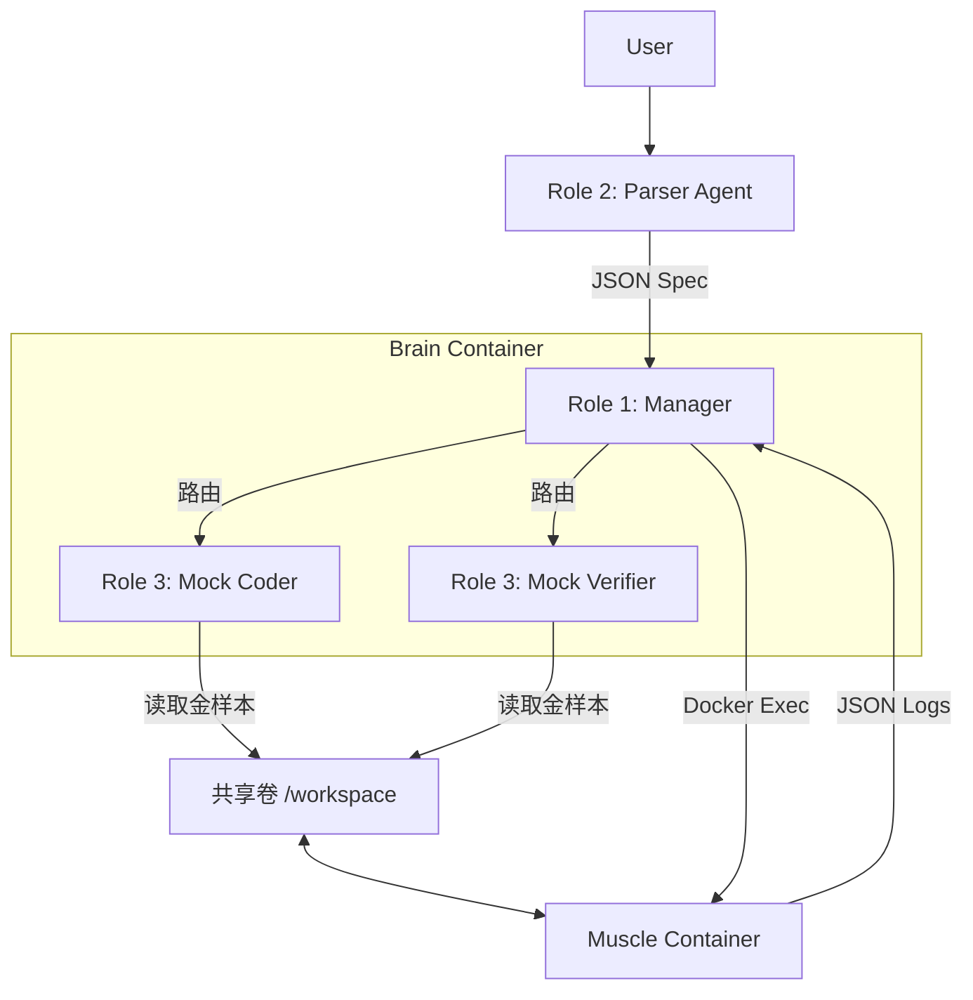

这是一个为你整理好的 `README_dev.md`。它汇集了我们讨论的所有架构决策、文件结构、开发流程和接口契约。

你可以直接将此文件提交到项目根目录，作为团队开发的**核心指导文档**。

---

# HDL-Agent Developer Documentation

> **Project Status:** Phase 1 (Infrastructure & Mocking)
> **Target:** Build a stable execution pipeline before integrating LLM Code Generation.

本文档旨在指导 **HDL-Agent** 项目的开发。本项目采用了 **Full-Dockerized Microservices** 架构，利用 LangGraph 进行状态管理，Docker 进行沙盒仿真。

---

## 1. 架构概览 (Architecture)

系统由两个核心 Docker 容器组成，通过 Docker Compose 编排：

1. **🧠 Brain (`agent-core`):**
* 运行 Python, LangGraph, LangChain。
* 负责：自然语言解析 (Parser)、任务路由 (Manager)、状态管理。
* **权限:** 挂载了宿主机的 `/var/run/docker.sock`，因此可以指挥 Sandbox 容器。


2. **💪 Muscle (`eda-sandbox`):**
* 运行 Ubuntu, Verilator, Cocotb, Pyuvm。
* 负责：编译 Verilog，运行 Python 仿真测试。
* **状态:** 后台静默运行，等待 Brain 通过 Docker Exec 调用。


### 逻辑数据流 (Phase 1)



---

## 2. 快速开始 (Quick Start)

**前置要求:** Linux 环境 (推荐 Ubuntu/WSL2), Docker, Docker Compose。

### 🚀 一键启动环境

不要手动构建镜像，使用项目根目录下的自动化脚本：

```bash
# 1. 初始化配置并启动容器
python3 setup_project.py

# 2. 看到 "容器启动成功" 后，进入开发环境（大脑容器）
docker exec -it hdl_agent_core bash

# 3. (在容器内) 运行主程序
python app/main.py

```

### 常用运维命令

* **查看实时日志:** `docker compose logs -f`
* **重启环境:** `docker compose restart`
* **完全重置:** `docker compose down && python3 setup_project.py`
* **手动调试仿真:**
```bash
# 进入沙盒容器
docker exec -it hdl_sandbox bash
# 此时你在 /workspace，可以直接运行 make 或 python 脚本

```


---

## 3. 项目结构与所有权 (Directory Structure)

| 路径 | 说明 | 负责人 (Role) |
| --- | --- | --- |
| **`app/core/`** | 全局状态定义 (`state.py`) | **Role 1 (Arch)** |
| **`app/graph/`** | LangGraph 图编排与路由 | **Role 1 (Arch)** |
| **`app/agents/parser/`** | Prompt 调试与 JSON 校验 | **Role 2 (Parser)** |
| **`app/agents/hdl_coder/`** | HDL 生成 (目前仅包含 `mock.py`) | **Role 3 (Infra)** |
| **`app/infrastructure/`** | Docker SDK 封装与 MCP 工具 | **Role 3 (Infra)** |
| **`deploy/`** | Dockerfile 定义 (Brain & Muscle) | **Role 3 (Infra)** |
| **`data/golden_samples/`** | 手写的 Verilog/Pyuvm 标准样例 | **Role 3 (Infra)** |
| **`spec_definition.json`** | **[核心契约]** JSON 接口定义 | **全员** |

---

## 4. 核心契约 (Contracts)

所有开发工作必须严格遵守以下数据结构。

### A. 通用需求定义 (JSON Spec)

Parser (Role 2) 的输出 **必须** 符合此格式，Coder (Role 3) 的输入 **必须** 依赖此格式。

```json
{
  "project_name": "counter_8bit",
  "requirements": {
    "module_name": "counter",
    "description": "An 8-bit up counter with async reset.",
    "ports": [
      {"name": "clk", "direction": "input", "width": 1},
      {"name": "rst_n", "direction": "input", "width": 1},
      {"name": "count_out", "direction": "output", "width": 8}
    ]
  },
  "parameters": {
    "MAX_COUNT": 255
  }
}

```

### B. 状态机定义 (AgentState)

LangGraph 中流转的全局变量 (`app/core/state.py`)：

```python
class AgentState(TypedDict):
    messages: List[str]          # 用户对话历史
    spec_json: Optional[dict]    # 上述 JSON Spec
    verilog_code: Optional[str]  # HDL 源码
    testbench_code: Optional[str]# Python 测试源码
    simulation_logs: str         # Docker 返回的原始日志
    status: str                  # "IDLE", "PARSING", "CODING", "VERIFYING", "ERROR"
    error_analysis: dict         # 日志归因结果

```

---

## 5. 开发分工与当前任务 (Phase 1: Mocking)

**当前目标:** 跑通 `User -> Parser -> Manager -> Mock Coder -> Docker -> Result` 的完整闭环。**暂不接入 LLM 生成代码。**

### 🧑‍💻 Role 1: 架构师 (Manager)

* **任务:**
1. 实现 `app/graph/workflow.py`，串联各节点。
2. 实现 `app/graph/router.py`。逻辑：如果 `simulation_logs` 包含 "FAIL"，则路由到重试（或报错）；如果 "PASS"，则结束。
3. 编写日志分析器，区分 `Compile Error` (Verilator挂了) 和 `Assertion Error` (Pyuvm挂了)。


### 🧑‍💻 Role 2: 解析专家 (Parser)

* **任务:**
1. 调试 Prompt (`app/agents/parser/prompts.py`)，确保能处理 "Active Low Reset", "AXI Interface" 等术语。
2. 实现 `validator.py`，用 Python 校验 JSON 里的端口位宽是否合法。
3. **交付物:** 必须包含一个测试脚本 `tests/test_parser_cases.py`，能通过 10+ 个自然语言用例。


### 🧑‍💻 Role 3: 基建与仿真 (Infra)

* **任务:**
1. 编写 **Golden Samples** (`data/golden_samples/counter/`): 手写一个完美的 Verilog 计数器和对应的 pyuvm 测试。
2. 实现 `app/infrastructure/docker_client.py`:
* 函数 `run_simulation(verilog, testbench)`。
* 功能：将字符串写入 `data/workspace/`，调用 `docker exec hdl_sandbox make`，并返回 stdout。


3. 实现 Mock 逻辑：在 `hdl_coder/mock.py` 中读取 Golden Samples 并返回，假装是 AI 生成的。


---

## 6. 开发规范 (Workflow)

1. **Git 分支策略:**
* `main`: 随时可运行的稳定版本。
* `feat/parser-xxx`: Role 2 的开发分支。
* `feat/infra-xxx`: Role 3 的开发分支。


2. **代码位置:**
* **严禁** 在本地机器运行 `python app/main.py` (缺少依赖)。
* **必须** 在容器内运行代码。
* 在宿主机修改代码 -> 保存 -> 容器内自动生效 (Volume 挂载)。


3. **提交前检查:**
* 确保 `tests/` 下的单元测试能通过。
* 不要提交 `data/workspace/` 下的临时波形文件。


---

## 7. 常见问题 (Troubleshooting)

**Q: 报错 `Permission denied` when connecting to Docker socket?**

* **A:** 宿主机执行 `sudo chmod 666 /var/run/docker.sock`，或者确保当前用户在 docker 用户组。

**Q: 容器内找不到 `verilator`?**

* **A:** 只有 `eda-sandbox` 容器装了 Verilator。`agent-core` 容器是通过 docker sdk 远程调用它的，不要在 `agent-core` 里尝试运行 verilator。

**Q: Python 依赖缺失?**

* **A:** 如果你加了新包到 `requirements.txt`，需要运行 `docker compose up --build -d` 重新构建大脑容器。